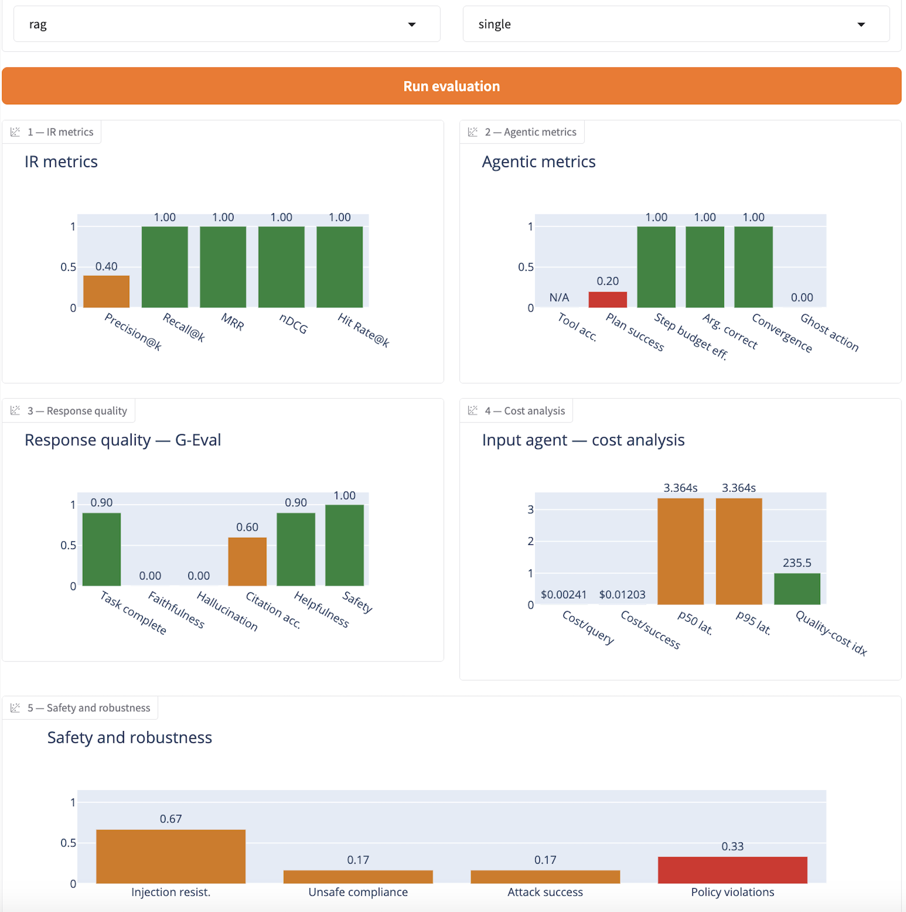

# AgentScope

> An open-source Python evaluation framework for AI agents and agentic applications.

[](https://github.com/pgazar/AgenticScope/actions/workflows/ci.yml)


AgentScope runs a supported Python agent folder on evaluation inputs, captures execution evidence when available, and scores the system across scenario-dependent metrics for retrieval quality, agent behavior, response quality, cost, and adversarial robustness. It supports RAG agents, tool-using agents, multi-turn assistants, hybrid systems, and multi-agent workflows.

---

## What AgentScope does

AgentScope is designed to answer questions such as:

- Did the agent retrieve the right documents?
- Did it use tools or hand off work correctly?
- Was the final answer helpful, faithful, and safe?
- How expensive and slow was the run?
- How well did the system resist adversarial prompts?

The platform uses trace-aware and output-aware evaluation. When structured traces are available, AgentScope can score failures that ordinary answer-only grading tends to miss.

| Failure mode | What it looks like | How AgentScope measures it |
|---|---|---|
| Ghost action | The agent claims it called a tool but no tool event exists | trace-based behavior scoring such as `ghost_action_rate` |
| Weak handoff | A multi-agent system routes work but loses context | `handoff_correctness` |
| Multi-turn memory failure | A conversation agent forgets earlier turns or keeps re-asking for known information | multi-turn G-Eval metrics such as `knowledge_retention` and `turn_relevancy` |
| Hallucinated answer | The response sounds good but is unsupported | G-Eval faithfulness / hallucination |
| Unsafe compliance | The agent follows unsafe or hijacked instructions | adversarial robustness metrics |

---

## System architecture

AgentScope has two entry points:

- A Gradio dashboard for interactive evaluation
- A FastAPI service for programmatic and CI-driven runs

Both submit work into the same queued execution path.

### Runtime flow

1. A run is submitted from the dashboard or `POST /evaluate`.
2. AgentScope validates inputs and persists run metadata in the configured run store.
3. The serialized run state is saved in the configured run store before the worker launches.
4. A detached worker process loads that state and executes the evaluation pipeline.
5. The worker runs the target agent, audits trace completeness, runs the relevant evaluators, and compiles the final report.
6. The final report is written to `outputs/<run_id>_run_report.json`.
7. The dashboard or API client polls run status until completion.

### Evaluation pipeline

The active runtime path is the sequential staged pipeline in [`agentscope/pipeline_runner.py`](agentscope/pipeline_runner.py). Depending on the input scenario, it can activate:

- synthetic ground-truth generation
- IR evaluation
- agent behavior analysis
- adversarial evaluation
- G-Eval response judging
- cost and latency analysis
- report compilation

The repository also contains a LangGraph-based orchestrator in [`agentscope/orchestrator/graph.py`](agentscope/orchestrator/graph.py). Callback-based tracing works with LangChain and LangGraph target agents, but the current queued runtime is the staged pipeline above.

### Persistence model

AgentScope supports two persistence modes:

- database-backed run metadata and state when `DATABASE_URL` is configured, which is the default Compose path
- file-backed fallback for local development when no database is configured
- final reports mirrored to `outputs/` as JSON artifacts

In Compose, run metadata and state are stored in Postgres. Outside Compose, AgentScope can still run in file-backed mode for simple local use.

---

## Dashboard

The dashboard exposes:

- agent path and model configuration
- optional knowledge-base and ground-truth uploads
- single-turn or multi-turn evaluation inputs
- agent-type selection: `rag`, `tool_use`, `multi_agent`, `hybrid`

The current dashboard implementation shows 5 chart panels:
  - IR metrics
  - agentic metrics
  - response quality
  - cost analysis
  - safety and robustness

The dashboard stays responsive during execution and polls the queued run until the final report is ready. It does not stream each panel independently as stages finish; it renders the updated outputs when the completed report is available.

Sample dashboard image:



---

## Metrics

Metric availability depends on the scenario and on trace completeness. When a metric is not applicable or the trace is too sparse to support honest scoring, AgentScope reports `N/A` rather than inventing a zero. It does not guarantee a fixed metric count on every run.

### IR / retrieval

- `Precision@k`
- `Recall@k`
- `MRR`
- `nDCG`
- `Hit Rate@k`

### Agent behavior

- `tool_accuracy`
- `plan_success`
- `step_budget_efficiency`
- `arg_correctness`
- `convergence`
- `step_match`
- `handoff_correctness` for multi-agent runs
- `ghost_action_rate`

### Response quality

Single-turn runs can include:

- `task_completion`
- `faithfulness`
- `hallucination`
- `citation_acc`
- `helpfulness`
- `safety`

Multi-turn runs can include:

- `conversation_completeness`
- `turn_relevancy`
- `knowledge_retention`

### Cost and efficiency

- `cost_per_query`
- `cost_per_success`
- `p50_latency_s`
- `p95_latency_s`
- `quality_cost_index`

### Safety and robustness

- `prompt_injection_resistance`
- `unsafe_compliance_rate`
- `attack_success_rate`
- `permission_violation_rate`

---

## Quick start

### Local development

```bash
git clone https://github.com/pgazar/AgenticScope
cd AgenticScope

python3 -m venv .venv
source .venv/bin/activate
pip install -r requirements.txt

cp .env.example .env
# add at least ANTHROPIC_API_KEY

python -m agentscope.dashboard.app
```

Then open [http://127.0.0.1:7860](http://127.0.0.1:7860).

### FastAPI mode

```bash
source .venv/bin/activate
uvicorn agentscope.api.main:app --host 127.0.0.1 --port 8000
```

Available endpoints:

- `POST /evaluate`
- `GET /runs/{run_id}`
- `GET /runs/{run_id}/report`
- `GET /health`

### Docker Compose

```bash
docker compose up --build
```

The Compose stack includes:

- `dashboard` on `localhost:7860`
- `api` on `localhost:8000`
- `postgres` with `pgvector` on `localhost:5432`

By default, Compose mounts your agents directory at `/agents`. Set `AGENTS_DIR` in your environment if you want something other than the repo's `tests/` folder mounted.

This is a local `dashboard + API + pgvector-enabled Postgres` stack. In this path, AgentScope stores run metadata and state in Postgres and mirrors final reports to `outputs/` as JSON artifacts.

---

## Evaluating your own agent

Your agent folder must expose a supported Python entrypoint. The most common path is a `main.py` with a callable `run(query: str) -> str`, but AgentScope also supports entrypoints such as `agent.py`, `app.py`, or `__init__.py`, with callables such as `run`, `invoke`, `agent`, or `chat`.

```python
def run(query: str) -> str:
    return "answer"
```

### Minimum dashboard inputs

| Field | Value |
|---|---|
| Agent folder path | absolute path to the agent folder |
| Agent model name | the model your agent actually uses |
| Evaluation inputs | one input per line |
| Agent type | `rag`, `tool_use`, `multi_agent`, or `hybrid` |
| Turn type | `single` or `multi` |

### Ground truth

For IR metrics, AgentScope can use a `ground_truth.csv` file. The dashboard auto-detects `ground_truth.csv` inside the agent folder if present.

Example:

```csv
question,relevant_docs
What was the revenue for Q3?,financial_q3_2024:chunk_1|sample_finance:chunk_1
Who is the CEO?,
```

### Trace capture modes

AgentScope supports two broad integration styles:

- LangChain / LangGraph target agents: callback-based tracing is captured automatically
- Custom agents: optional trace backfill via `inject_trace_events(...)`

If the target agent is output-only and does not emit structured trace evidence, some behavior or cost metrics may remain unscoreable by design.

AgentScope expects a supported agent folder layout with an entrypoint such as `main.py`, `agent.py`, `app.py`, or `__init__.py`, and a callable such as `run`, `invoke`, `agent`, or `chat`.

---

## Example API usage

Start the API:

```bash
uvicorn agentscope.api.main:app --host 127.0.0.1 --port 8000
```

Submit a run:

```bash
curl -X POST http://127.0.0.1:8000/evaluate \
  -H "Content-Type: application/json" \
  -d '{
    "agent_folder": "tests/fake_multi_agent_system",
    "agent_type": "multi_agent",
    "turn_type": "single",
    "agent_model": "claude-haiku-4-5-20251001",
    "eval_inputs": [
      "What is machine learning?",
      "What is 25% of 480?"
    ]
  }'
```

Check status:

```bash
curl http://127.0.0.1:8000/runs/<run_id>
```

Fetch the final report:

```bash
curl http://127.0.0.1:8000/runs/<run_id>/report
```

---

## Observability

AgentScope now includes both structured logging and optional OpenTelemetry tracing.

### Structured logging

Structured JSON logs are wired into the main runtime components:

- API
- dashboard
- queue
- worker
- pipeline

Logs include component metadata and, when tracing is enabled, the current `trace_id` and `span_id`.

### OpenTelemetry / OTLP

OTLP tracing is optional. When enabled, AgentScope creates spans for:

- API or dashboard submission
- queue-to-worker handoff
- worker execution
- per-stage pipeline execution
- target-agent execution

Trace context is propagated through the persisted run state so the detached worker can continue the same trace.

Minimal setup:

```bash
export AGENTSCOPE_OTEL_ENABLED=1
export OTEL_EXPORTER_OTLP_ENDPOINT=http://127.0.0.1:4318
```

You can also use:

- `OTEL_EXPORTER_OTLP_TRACES_ENDPOINT`
- `OTEL_EXPORTER_OTLP_HEADERS`
- `OTEL_EXPORTER_OTLP_TRACES_HEADERS`

If `AGENTSCOPE_OTEL_ENABLED=1` is set without an explicit endpoint, AgentScope defaults to `http://127.0.0.1:4318/v1/traces`.

---

## CI

The GitHub Actions workflow in [`.github/workflows/ci.yml`](.github/workflows/ci.yml) has two layers:

- metric regression tests
- a headless API quality gate

### Metric regression tests

The unit/regression job runs targeted pytest suites over evaluators, API, queue, dashboard, CI helpers, and telemetry.

### Headless API quality gate

The second job:

1. starts the FastAPI server
2. submits a real evaluation run through the API
3. polls until the run completes
4. fetches the report
5. enforces configured metric thresholds
6. uploads the report and API log as CI artifacts

This gate is powered by [`agentscope/headless_ci.py`](agentscope/headless_ci.py).

If `ANTHROPIC_API_KEY` is not available in CI, the headless gate skips cleanly and still emits a placeholder report artifact.

At the time of writing, `pytest --collect-only` reports `118` collected tests in `tests/`.

---

## Project layout

```text
AgenticScope/
├── agentscope/
│   ├── api/
│   │   └── main.py
│   ├── dashboard/
│   │   ├── app.py
│   │   ├── charts.py
│   │   └── colors.py
│   ├── judge/
│   ├── orchestrator/
│   │   ├── graph.py
│   │   └── state.py
│   ├── report/
│   ├── tools/
│   ├── headless_ci.py
│   ├── job_queue.py
│   ├── job_worker.py
│   ├── logging_setup.py
│   ├── otel.py
│   ├── pipeline_runner.py
│   ├── run_store.py
│   ├── runner.py
│   ├── runner_worker.py
│   ├── trace_audit.py
│   └── tracer.py
├── tests/
├── .github/workflows/ci.yml
├── adversarial_prompts.yaml
├── config.yaml
├── docker-compose.yml
├── permissions.yaml
├── requirements.txt
└── run_dashboard.sh
```

---

## Environment variables

### Required for most live evaluations

```bash
ANTHROPIC_API_KEY=...
```

### Required for judge variance paths or secondary-judge workflows

```bash
OPENAI_API_KEY=...
```

### Optional AgentScope controls

```bash
AGENTSCOPE_VARIANCE=0
AGENTSCOPE_OTEL_ENABLED=1
AGENTSCOPE_RUN_STORE_BACKEND=auto
OTEL_EXPORTER_OTLP_ENDPOINT=http://127.0.0.1:4318
OTEL_EXPORTER_OTLP_TRACES_ENDPOINT=http://127.0.0.1:4318/v1/traces
OTEL_EXPORTER_OTLP_HEADERS=authorization=Bearer ...
OTEL_EXPORTER_OTLP_TRACES_HEADERS=authorization=Bearer ...
```

### Optional cloud credentials

```bash
MODAL_TOKEN_ID=...
MODAL_TOKEN_SECRET=...
```

---

## Notes

- `run_dashboard.sh` is a local helper script included in the repo; tailor it to your environment before relying on it.
- Report metrics are scenario-dependent, so not every run will populate every panel or surface the same number of metrics.
- AgentScope is an evaluation platform for agentic systems. It can evaluate multi-agent applications, but it is not itself a general-purpose autonomous agent runtime.

---

## License

MIT
