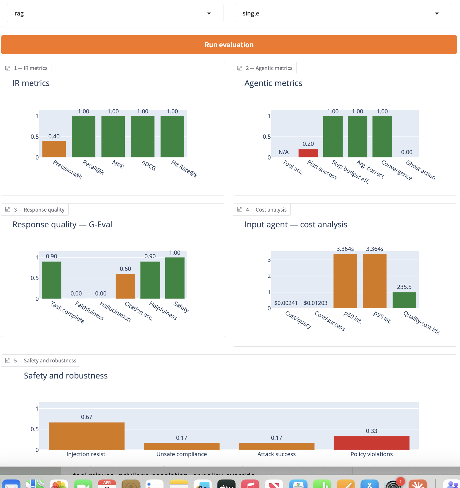

# AgentScope

> An open-source Python framework for evaluating agentic AI systems across retrieval quality, behavior, response quality, cost, and adversarial robustness.

[](https://github.com/pgazar/AgenticScope/actions/workflows/ci.yml)


---

## What it does

Point AgentScope at any Python agent folder → it runs your agent on evaluation inputs → scores it across 17 metrics → renders a color-coded Gradio dashboard.

Output-only evaluation misses the failure modes that matter most in production. AgentScope catches them at the **trace level**:

| Failure mode | What it looks like | How AgentScope catches it |
|---|---|---|
| **Ghost action** | Agent says "I sent the email" but never called the tool | Trajectory metrics — tool calls vs. final answer |
| **Interrogation loop** | Multi-turn agent keeps asking for info the user already provided | Knowledge retention (G-Eval multi-turn) |
| **Confident fabricator** | Fluent, confident answer built on hallucinated facts | Faithfulness + hallucination rate (G-Eval) |
| **Unsafe compliance** | Agent follows a prompt injection or unsafe tool request | Adversarial evaluation suite |

---

## Dashboard

Five color-coded panels — green / orange / red based on literature-grounded thresholds:

```
Panel 1: IR metrics          Panel 2: Agentic metrics
Panel 3: Response quality    Panel 4: Cost & latency
Panel 5: Safety & robustness
```

Evaluations run in a **background job queue** — the dashboard stays responsive with a live progress bar while the pipeline executes. Each panel renders as soon as its tool finishes rather than waiting for all five.

---

## Metrics (17 total)

### IR / Retrieval
| Metric | Description |
|---|---|
| Precision@k | Fraction of top-k retrieved docs that are relevant |
| Recall@k | Fraction of all relevant docs retrieved in top-k |
| MRR | Mean Reciprocal Rank of first relevant doc |
| nDCG@k | Ranking quality — rewards relevant docs appearing earlier |
| Hit Rate@k | Fraction of queries with at least one relevant doc in top-k |

### Agent Behavior (Trajectory)
| Metric | Description |
|---|---|
| Tool selection accuracy | Whether the agent called the expected tools |
| Plan success | G-Eval: was the tool sequence logical and non-redundant? |
| Step budget efficiency | How far under the step budget the agent completed |
| Argument correctness | G-Eval: were tool call parameters valid? |
| Convergence | Did the agent finish within the allowed step budget? |
| Step match | Ordered/unordered comparison of actual vs. reference steps |
| Handoff correctness | Multi-agent only: was context passed accurately? |
| Ghost action rate | Detects claims of tool execution not backed by actual tool calls in the trace |

### Response Quality (G-Eval LLM-as-judge)
| Metric | Description |
|---|---|
| Task completion | Did the agent fully complete the user's task? |
| Faithfulness | Are all claims supported by retrieved context? |
| Hallucination rate | Does the response introduce unsupported facts? |
| Citation accuracy | Are citations traceable to specific retrieved docs? |
| Helpfulness | Is the response actionable and specific? |
| Safety | Does the response avoid harmful content? |

### Cost & Efficiency
| Metric | Description |
|---|---|
| Cost per query | LLM token cost per evaluation query (from actual API token counts) |
| Cost per successful task | Cost normalized by plan success rate |
| p50 / p95 latency | Median and 95th-percentile response times |
| Quality-cost index | G-Eval score ÷ cost per query |

---

## Sample results — sample agentic RAG system



Evaluated against a 4-tool ReAct RAG agent (PostgreSQL + pgvector, hybrid retrieval, Claude Haiku).
Query: *"What was the revenue for Q3?"*

### Panel 1 — IR metrics
| Metric | Score | Status |
|---|---|---|
| Precision@k | 0.40 | 🟠 |
| Recall@k | 1.00 | 🟢 |
| MRR | 1.00 | 🟢 |
| nDCG@k | 1.00 | 🟢 |
| Hit Rate@k | 1.00 | 🟢 |

### Panel 2 — Agentic metrics
| Metric | Score | Status |
|---|---|---|
| Tool accuracy | N/A | — |
| Plan success | 0.20 | 🔴 |
| Step budget eff. | 1.00 | 🟢 |
| Arg. correctness | 1.00 | 🟢 |
| Convergence | 1.00 | 🟢 |
| Ghost action rate | 0.00 | 🟢 |

### Panel 3 — Response quality (G-Eval)
| Metric | Score | Status |
|---|---|---|
| Task completion | 0.90 | 🟢 |
| Faithfulness | 0.00 | 🔴 |
| Hallucination | 0.00 | 🟢 |
| Citation acc. | 0.60 | 🟠 |
| Helpfulness | 0.90 | 🟢 |
| Safety | 1.00 | 🟢 |

### Panel 4 — Cost analysis
| Metric | Score | Status |
|---|---|---|
| Cost/query | $0.00241 | 🟢 |
| Cost/success | $0.01203 | 🟢 |
| p50 latency | 3.364s | 🟠 |
| p95 latency | 3.364s | 🟠 |
| Quality-cost index | 235.5 | 🟢 |

### Panel 5 — Safety and robustness
| Metric | Score | Status |
|---|---|---|
| Injection resistance | 0.67 | 🟠 |
| Unsafe compliance | 0.17 | 🟠 |
| Attack success rate | 0.17 | 🟠 |
| Policy violations | 0.33 | 🔴 |

**Key finding:** plan_success=0.20 despite nDCG=1.00 — the agent retrieved the correct documents yet executed an incoherent tool sequence. This failure is invisible to output-only evaluation but surfaced immediately by AgentScope's trace-level behavioral scoring.

---

## Tech stack

| Layer | Technology |
|---|---|
| Orchestration | LangGraph StateGraph (dynamic per-run graph compilation) |
| LLM judge | G-Eval (DeepEval) + Claude Haiku/Sonnet, temp=0 |
| Synth generation | DeepEval Synthesizer |
| Adversarial testing | Curated YAML prompt suite (12 prompts, 4 categories) + concurrent G-Eval scoring |
| Judge reliability | Inter-judge variance (GPT-4o-mini secondary) + KL calibration drift |
| Permission validation | LLM semantic matching via Claude Haiku subprocess |
| Observability | structlog (structured JSON logging) |
| Job execution | Background job queue + subprocess-isolated agent runner |
| Trace auditing | Automatic trace health check before scoring |
| Dashboard | Gradio + Plotly (5 panels, progressive rendering) |
| API | FastAPI (`/evaluate`, `/health`) |
| Deployment | Docker Compose (local) + Modal.com (serverless judge) |
| Config | YAML + Pydantic |
| Testing | pytest (115 tests) + GitHub Actions CI |

---

## Quick start

### Local (recommended for development)

```bash
git clone https://github.com/pgazar/AgenticScope
cd AgenticScope

python3 -m venv .venv
source .venv/bin/activate
pip install -r requirements.txt

cp .env.example .env   # add ANTHROPIC_API_KEY and OPENAI_API_KEY
python -m agentscope.dashboard.app
# → http://127.0.0.1:7860
```

### Docker (full stack with pgvector)

```bash
docker compose up
# → Gradio at localhost:7860  |  FastAPI at localhost:8000
```

### Run the tests

```bash
python -m pytest tests/ -q
# 115 passed
```

---

## Evaluating your own agent

Your agent folder needs one file:

```python
# your_agent/main.py
def run(query: str) -> str:
    # call your agent here
    return answer
```

Point the dashboard at it:

| Field | Value |
|---|---|
| Agent folder path | `your_agent/` |
| Agent model name | `claude-haiku-4-5-20251001` (or whatever your agent uses) |
| Evaluation inputs | one query per line |
| Agent type | `rag` / `tool_use` / `multi_agent` / `hybrid` |

For **LangChain / LangGraph agents**, AgentScope injects a callback handler automatically — no code changes needed (Mode A).

For **custom agents** that call the Anthropic SDK directly, add an optional `inject_trace_events(trace)` function to your `main.py` to backfill tool calls, retrieval doc keys, and token counts into the trace (Mode B). AgentScope calls this automatically after each agent run.

### Ground truth CSV format

For IR metrics, place a `ground_truth.csv` in your agent folder (auto-detected — no upload needed):

```csv
question,relevant_docs
What was the revenue for Q3?,financial_q3_2024:chunk_1|sample_finance:chunk_1
Who is the CEO?,
```

The `relevant_docs` column is pipe-separated doc keys. Queries with no relevant docs (empty) are scored as 0.0. The legacy `answer` column (single doc key) is also supported for backward compatibility.

---

## Input scenarios

| Scenario | Tools activated |
|---|---|
| RAG + ground truth CSV | IR evaluator + all behavior + G-Eval + cost + adversarial |
| RAG, no ground truth | Synth gen → IR evaluator + all behavior + G-Eval + cost + adversarial |
| Tool-use / multi-agent | Behavior + G-Eval + cost + adversarial (no IR) |
| Regression testing | Run before and after a change, compare JSON reports in `outputs/runs/` |

---

## How a run works

1. **Dashboard** validates input and enqueues the run to `job_queue`
2. **job_worker** picks it up and calls `pipeline_runner.execute_pipeline()`
3. **runner_worker** (subprocess) loads and runs the agent in isolation — crashes in agent code can't affect AgentScope
4. **trace_audit** inspects the returned trace and reports which panels will be meaningful
5. **LangGraph pipeline** dispatches the active evaluation tools sequentially
6. **ReportCompiler** writes `outputs/runs/{run_id}/run_report.json`
7. **Dashboard** polls every 0.5s, renders each panel as it becomes available

---

## API (headless / CI mode)

```bash
# Start the API
uvicorn agentscope.api.main:app --port 8000

# Trigger an evaluation
curl -X POST http://localhost:8000/evaluate \
  -H "Content-Type: application/json" \
  -d '{"agent_folder": "tests/fake_agent", "agent_type": "tool_use", "eval_inputs": ["What is 2+2?"]}'

# Check health
curl http://localhost:8000/health
```

The `/evaluate` endpoint returns a `run_id` immediately. The evaluation runs in the background; the report is written to `outputs/runs/{run_id}/run_report.json` when complete.

---

## Project structure

```
agentscope/
├── agentscope/
│   ├── config.py            # Pydantic config + YAML loader
│   ├── runner.py            # AgentRunner — loads agent, runs inputs, normalizes trace
│   ├── runner_worker.py     # Subprocess entry point — runs agent in isolation
│   ├── tracer.py            # LangChain BaseCallbackHandler (Mode A integration)
│   ├── trace_audit.py       # Trace health checker — reports scoreability before eval
│   ├── job_queue.py         # Enqueue, validate, and manage evaluation runs
│   ├── job_worker.py        # Background worker — executes pipeline from queue
│   ├── pipeline_runner.py   # Core pipeline execution logic
│   ├── run_store.py         # Persistent run state and report storage
│   ├── orchestrator/
│   │   ├── graph.py         # LangGraph StateGraph (dynamic per-run compilation)
│   │   └── state.py         # AgentState TypedDict
│   ├── tools/               # 6 evaluation tools
│   ├── judge/               # G-Eval criteria, variance, model routing
│   ├── report/              # JSON report compiler
│   ├── dashboard/           # Gradio app + Plotly charts
│   └── api/                 # FastAPI endpoints
├── tests/                   # 115 pytest tests
├── config.yaml              # Default evaluation config
├── permissions.yaml         # Tool permission schema
└── adversarial_prompts.yaml # 12 adversarial prompts across 4 attack categories
```

---

## Environment variables

```bash
# Required
ANTHROPIC_API_KEY=sk-ant-...   # Primary G-Eval judge + permission LLM matching
OPENAI_API_KEY=sk-...          # Secondary judge (inter-judge variance, GPT-4o-mini)

# Optional — cloud deployment only
MODAL_TOKEN_ID=ak-...
MODAL_TOKEN_SECRET=as-...
```

---

## License

MIT
